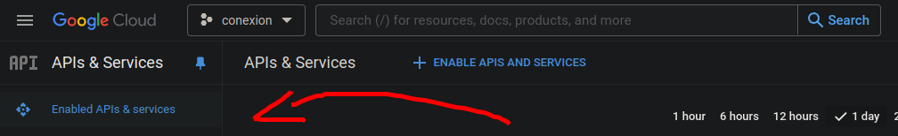
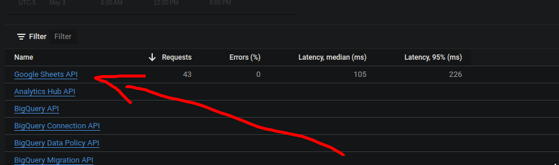
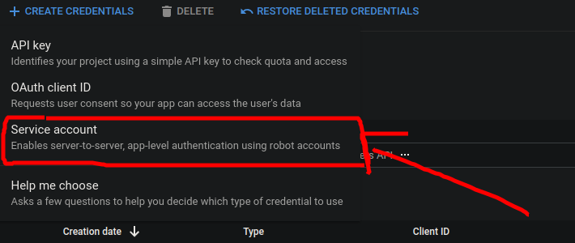
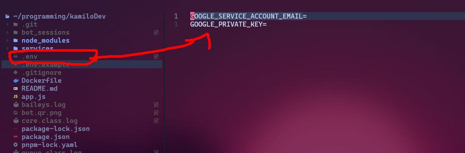

## Introduction

My curiosity led me to explore the scope of programming, and I realized it can solve very everyday problems. A colleague who owned a restaurant struggled with displaying orders to customers, which prompted me to research how to do it. I credit the person I saw doing it, Leifer Méndez, who created a library. I simply added the logic to make it work.


## considerations

The basis of this project is ease of use, for which it is linked to a Google spreadsheet. This requires having an account and being able to use the Google Cloud Console.



In addition to being able to use the console, you need to have the Google Sheets API enabled and configured in your credentials.



In addition, you need to configure the credentials in service account mode so that the project can connect and have read and write permissions to the spreadsheet.



You also need to obtain the spreadsheet ID and add the service account's email address as an editor and reader of the spreadsheet.



## Sheet Connection

```javascript

class GoogleSheetService {
  jwtFromEnv = undefined;
  doc = undefined;

  constructor(id = undefined) {
    if (!id) {
      throw new Error("ID_UNDEFINED");
    }

    this.jwtFromEnv = new JWT({
      email: process.env.GOOGLE_SERVICE_ACCOUNT_EMAIL,
      key: process.env.GOOGLE_PRIVATE_KEY.replace(/\\n/g, "\n"),
      scopes: SCOPES,
    });
    this.doc = new GoogleSpreadsheet(id, this.jwtFromEnv);
  }
```

## read

A flow that captures information from the cells.

```javascript
retriveDayMenu = async (columnNumber = 0) => {
  try {
    const list = [];
    await this.doc.loadInfo();
    const sheet = this.doc.sheetsByIndex[0]; // the first sheet
    await sheet.loadCells("A1:J10");
    const rows = await sheet.getRows();
    for (const a of Array.from(Array(rows.length).keys())) {
      const cellA1 = sheet.getCell(a + 1, columnNumber - 1);
      list.push(cellA1.value || null);
    }

    return list;
  } catch (err) {
    console.log(err);
    return undefined;
  }
};
```

## write

Writing the user-provided information into the spreadsheets.

```javascript
saveOrder = async (data = {}) => {
  await this.doc.loadInfo();
  const sheet = this.doc.sheetsByIndex[1]; // the first sheet

  const order = await sheet.addRow({
    fecha: data.fecha,
    telefono: data.telefono,
    nombre: data.nombre,
    pedido: data.pedido,
    observaciones: data.observaciones,
  });

  return order;
};
```

## Allow flows

To add the flows and make them accessible and callable through WhatsApp, they are added from this function.

```javascript

const main = async () => {
  const adapterDB = new MockAdapter();
  const adapterFlow = bot.createFlow([
    flowPrincipal,
    flowPedido,
    flowPollo,
    flowRes,
    flowCerdo,
    flowPescado,
    flowProteina,
    flowSopa,
    flowBebida,
    flowAcomp_a,
    flowAcomp_b,
    flowAcomp_c,

    flowEmpty,
  ]);
  const adapterProvider = bot.createProvider(BaileysProvider);

  bot.createBot({
    flow: adapterFlow,
    provider: adapterProvider,
    database: adapterDB,
  });
```

## flows

The development of a flow that looks at the user is written in the following way.

```javascript
const flowPrincipal = bot
  .addKeyword(["hola", "hi", "buenos dias", "buenas tardes"])
  .addAnswer([
    `Bienvenidos a mi restaurante de cocina economica automatizado! 🚀`,
    `Tenemos menus diarios variados`,
    `Te gustaria conocerlos ¿?`,
    `Escribe *si*`,
  ]);
```

### addkeyword

The "addkeyword" function adds the keywords that trigger the flow and are sent to the user in case they write the word "hello," "order," or any other array of words desired.

### addAnswer

In the case of "addanswer," it can capture the user's response, or the capture can be the invocation of another flow. It can be as customizable as needed.

```javascript

  .addAnswer(
    `¿Te interesa alguno marca la opcion?`,
    { capture: true },
    async (ctx, { gotoFlow, state }) => {
      try {
        const opcionSeleccionada = parseInt(ctx.body.trim()); // Convertir la opción seleccionada a un entero
        const seleccion = GLOBAL_STATE[opcionSeleccionada - 1]; // Obtener el elemento correspondiente en GLOBAL_STATE
        // Almacenar la selección del usuario en MENU_CLIENTE
        MENU_CLIENTE.acomp_a.push(seleccion);
        // Almacenar el elemento seleccionado en el estado
        state.update({ pedido: seleccion });

        GLOBAL_STATE = [];
        // Redirigir al flujo de pedido
        return gotoFlow(flowAcomp_b);
      } catch (error) {
        console.error("Ocurrió un error:", error);
        // Redirigir al flujo principal en caso de error
        return gotoFlow(flowPrincipal);
      }
    },
  );
```
