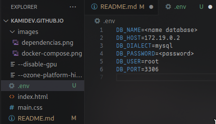
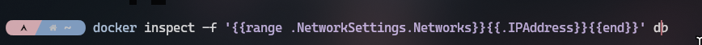
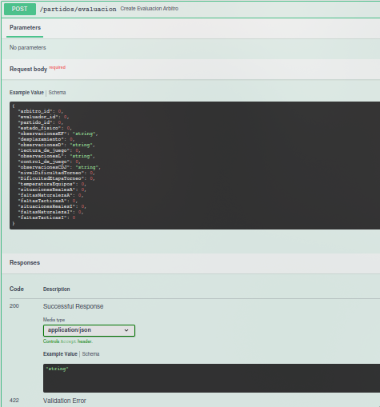
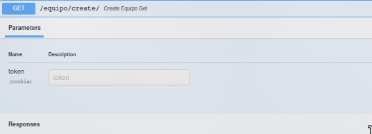
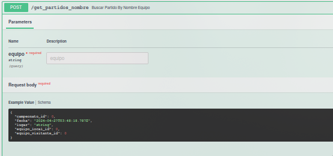
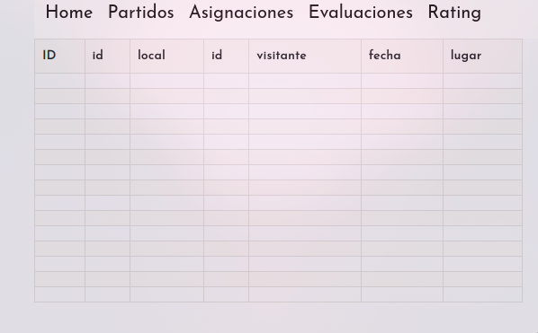
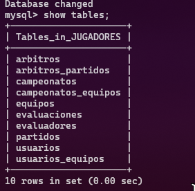

## Introduction:

Given that the majority of servers run on Linux, we'll be programming using Linux and utilizing an environment compatible with Linux.
The first step is to verify that Python is installed.

```bash
$ python --version
Python 3.11.8
```

Next, navigate to the project folder, Let's create the virtual environment.

```bash
$ python -m venv venv
```

Now we need to install the dependencies listed in the requirements.txt file.

```bash
$ source venv/bin/activate
$ pip install -r requirements.txt
```

Don`t forget to install docker and docker-compose

```bash
$ docker --version
```

Having Linux, I had to install other dependencies while being outside the virtual environment as Docker requires it.

```shell
    sudo apt-get install python3-dev default-libmysqlclient-dev build-essential
```

In the project, you will find a docker-compose.yml file. To run it, you need the following command

```shell
    docker-compose up- d
```

To communicate with the container, we need several pieces of information. To do this, I created a .env file with the environment variables that the backend needs to communicate with the database instance.



To obtain the host IP, we need to execute a command where the final word is the name of the container, in my case 'db'.



## Usage:

Let's start up the project, which runs on Uvicorn and the FastAPI framework.

```bash
$ uvicorn main:appi --reload
```

## FastAPI:

FastAPI is a modern, fast, easy-to-use, and open-source web framework for building APIs with Python 3.7+ and above.Additionally, it automatically brings up the documentation in Swagger.



## JWT:

My project implements JSON Web Tokens and maintains dependency injection to ensure the security of certain routes.


Very simple schemas for writing and reading parameters in JSON format.



Tables created from inner joins of other tables in the database.



Derived from various MySQL tables.



## HTML with Jinja2:

My project uses Jinja2 to render HTML templates.

## MySQL:

In addition, my project uses persistence volumes. It utilizes MySQL as the database.
